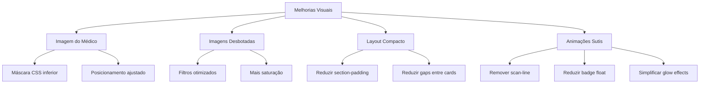

# Plano de Melhorias Visuais - DJR Ascend

## Resumo das Melhorias Propostas

### 1. Ajuste da Imagem do Médico (HeroSection)
**Problema:** A imagem atual do médico precisa de melhor apresentação e a área inferior precisa ser disfarçada.

**Solução:**
- Aplicar máscara CSS mais forte no fundo da imagem para esconder a área das calças
- Ajustar o posicionamento da imagem para mostrar mais o torso e menos a parte inferior
- Adicionar filtros sutis para melhorar a aparência profissional

### 2. Correção de Imagens Desbotadas
**Problema:** As imagens de fundo nos cards (ProblemsSection, CasesSection, ServicesSection) estão com aparência acinzentada devido aos filtros CSS.

**Solução:**
```css
/* Antes: */
filter: grayscale(1) contrast(1.15) brightness(0.75)

/* Depois: */
filter: grayscale(0.6) contrast(1.05) brightness(0.9) saturate(0.8)
```

### 3. Compactação do Layout
**Problema:** Espaçamento excessivo entre seções deixa a página longa e dispersa.

**Solução:**
```css
/* Antes: */
.section-padding: py-24 md:py-32 lg:py-36

/* Depois: */
.section-padding: py-16 md:py-20 lg:py-24
```

### 4. Simplificação de Animações
**Problemas identificados:**
- Badges flutuantes com animação infinita pode causar distração
- Efeito scan-line nos botões é muito técnico/clichê
- Glow effects excessivos em múltiplos cards

**Soluções:**
- Reduzir amplitude do float dos badges (de -10px para -4px)
- Remover efeito scan-line dos botões CTA
- Substituir glow-border por simples border-color transition
- Reduzir duração das animações de scroll

### 5. Melhorias de Contraste e Cores
**Ajustes propostos:**
- Aumentar opacidade das imagens de fundo nos cards (de 18% para 25%)
- Ajustar gradientes de sobreposição para melhor legibilidade
- Refinar cores de texto para melhor contraste

## Arquivos a Serem Modificados

1. `src/index.css` - Ajustes de padding, animações e filtros
2. `src/components/home/HeroSection.tsx` - Imagem do médico e badges
3. `src/components/home/ProblemsSection.tsx` - Filtros de imagens
4. `src/components/home/CasesSection.tsx` - Filtros de imagens
5. `src/components/home/ServicesSection.tsx` - Filtros de imagens
6. `src/components/home/MethodSection.tsx` - Ajustes de layout
7. `src/components/shared/ScrollReveal.tsx` - Simplificação de animações

## Diagrama de Mudanças



## Resultado Esperado

- Design mais profissional e polido
- Melhor legibilidade do conteúdo
- Interface mais compacta e coesa
- Animações sutis que não distraem
- Imagens com aparência mais viva e natural
